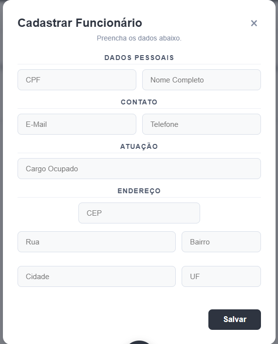
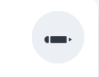

# 🏢 EmploYEE - Sistema de Gestão de Funcionários

Sistema completo para cadastro, edição e exclusão de funcionários com integração de endereço automático via CEP.

**🔗 Acesse o projeto:** https://employee-seven-azure.vercel.app/


## 2. BADGES (Status do Projeto)

 

## 🎥 Demonstração


## ✨ Funcionalidades

- ✅ **CRUD Completo** - Cadastre, edite, visualize e exclua funcionários
- 📍 **Busca Automática de CEP** - Endereço preenchido automaticamente via API ViaCEP
- ✅ **Validação em Tempo Real** - CPF válido, e-mail e nome completo
- 🎨 **Interface Responsiva** - Funciona em desktop e mobile
- 💾 **Persistência Local** - Dados salvos no localStorage
- 🔔 **Feedback Visual** - Toasts de confirmação e modais de exclusão

## 🛠️ Tecnologias Utilizadas

### Frontend
- **React** - Biblioteca principal
- **Hooks** (useState, useEffect) - Gerenciamento de estado
- **CSS Modules** - Estilização componentizada

### APIs e Serviços
- **ViaCEP API** - Busca automática de endereços

### Ferramentas
- **Git** - Controle de versão
- **VS Code** - Desenvolvimento

## 🚀 Como executar o projeto

### Pré-requisitos
- Node.js 16+
- npm ou yarn

### Instalação

1. Clone o repositório
```bash
git clone https://github.com/seu-usuario/emplo-yee.git
```
2. Entre na pasta
```bash
cd emplo-yee
```
3. Instale as dependências
```bash
npm install
# ou
yarn install
```
4. Execute o projeto
```bash
npm start
# ou
yarn start
```
5. Acesse no navegador (o npm já abre automaticamente)
```bash
http://localhost:3000
```

## 7. ESTRUTURA DE PASTAS

## 📁 Estrutura do Projeto

src/
├── Components/
│ ├── Button.js
│ ├── EmployeeList.js
│ └── FormFuncionario.js
├── App.js
├── App.css
└── index.js

## 📖 Como usar

### Cadastrar Funcionário
1. Clique no botão **+** (canto inferior da tela)
2. Preencha os dados pessoais
3. Digite o CEP - endereço preenche automático
4. Clique em **Salvar**



### Editar Funcionário
- Clique no ícone ✏ no card do funcionário
- Altere os dados necessários
- Salve as alterações



### Excluir Funcionário
- Clique no ícone 🗑
- Confirme a exclusão no modal


## 🤝 Contribuição

Contribuições são bem-vindas! Siga os passos:

1. Faça um fork
2. Crie uma branch (`git checkout -b feature/minha-feature`)
3. Commit suas mudanças (`git commit -m 'Adiciona feature'`)
4. Push (`git push origin feature/minha-feature`)
5. Abra um Pull Request

## 📄 Licença

Este projeto está sob a licença MIT. Veja o arquivo [LICENSE](LICENSE) para mais detalhes.

---

Criado por [Murilo Ribeiro da Silveira](https://github.com/MuriloRibeiro01).
